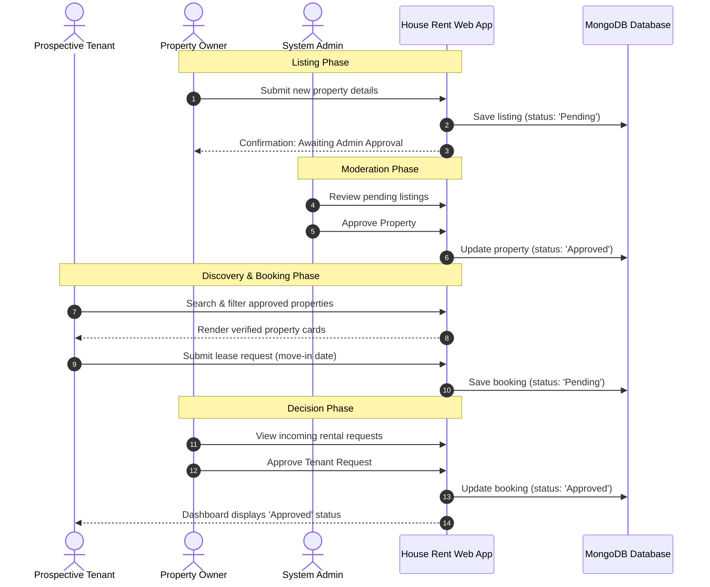

# Proposed Solution & User Interface Flow — House Rent

## 1. System Modules
The proposed solution comprises five tightly integrated subsystems:
1. **Authentication & Session Subsystem:** User registration, bcrypt password hashing, JWT stateless bearer token validation, and role identification.
2. **Catalog & Search Subsystem:** High-speed catalog search with multi-parameter filtering (Location, Min/Max Price, Property Type, Bedroom count, Newest/Price sort).
3. **Landlord Inventory Subsystem:** Property management dashboard allowing owners to list, modify, remove, and toggle availability of their homes.
4. **Booking & Lease Request Subsystem:** Tenant booking application pipeline with move-in date picker and notes.
5. **Administrative Governance Subsystem:** Moderation queue for review of new properties, platform statistics reporting, and user account management.

---

## 2. User Journey Workflow

