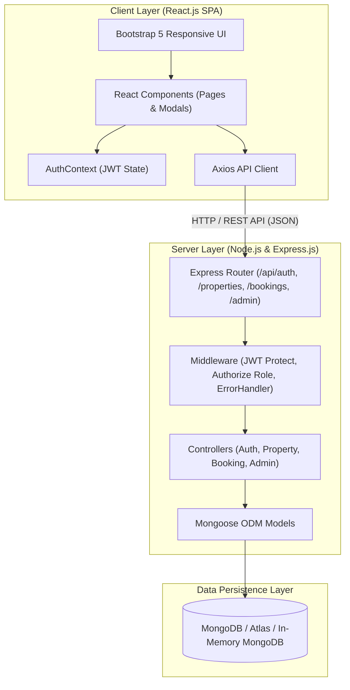
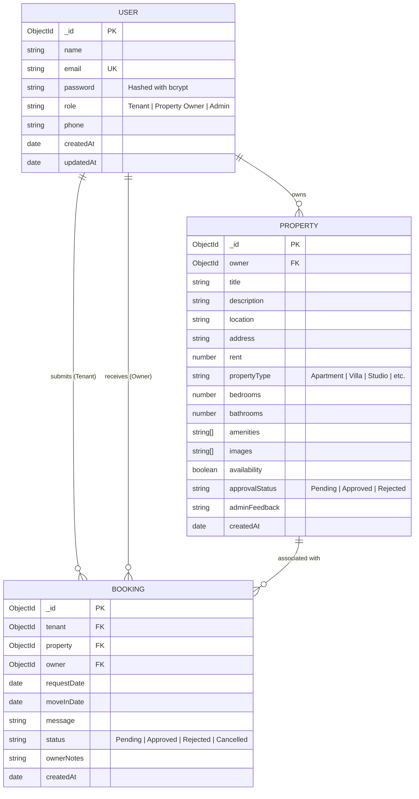

# Solution Architecture & Database Schema — House Rent

## 1. High-Level Solution Architecture

```mermaid
flowchart TD
    subgraph Client_Layer ["Client Layer (React.js SPA)"]
        UI["Bootstrap 5 Responsive UI"]
        RC["React Components (Pages & Modals)"]
        AC["AuthContext (JWT State)"]
        AX["Axios API Client"]
    end

    subgraph Server_Layer ["Server Layer (Node.js & Express.js)"]
        RT["Express Router (/api/auth, /properties, /bookings, /admin)"]
        MW["Middleware (JWT Protect, Authorize Role, ErrorHandler)"]
        CT["Controllers (Auth, Property, Booking, Admin)"]
        OD["Mongoose ODM Models"]
    end

    subgraph Data_Layer ["Data Persistence Layer"]
        DB[("MongoDB / Atlas / In-Memory MongoDB")]
    end

    UI --> RC
    RC --> AC
    RC --> AX
    AX -->|"HTTP / REST API (JSON)"| RT
    RT --> MW
    MW --> CT
    CT --> OD
    OD --> DB
```

---

## 2. Entity Relationship Diagram (ERD)

```mermaid
erDiagram
    USER ||--o{ PROPERTY : "owns"
    USER ||--o{ BOOKING : "submits (Tenant)"
    USER ||--o{ BOOKING : "receives (Owner)"
    PROPERTY ||--o{ BOOKING : "associated with"

    USER {
        ObjectId _id PK
        string name
        string email UK
        string password "Hashed with bcrypt"
        string role "Tenant | Property Owner | Admin"
        string phone
        date createdAt
        date updatedAt
    }

    PROPERTY {
        ObjectId _id PK
        ObjectId owner FK
        string title
        string description
        string location
        string address
        number rent
        string propertyType "Apartment | Villa | Studio | etc."
        number bedrooms
        number bathrooms
        string[] amenities
        string[] images
        boolean availability
        string approvalStatus "Pending | Approved | Rejected"
        string adminFeedback
        date createdAt
    }

    BOOKING {
        ObjectId _id PK
        ObjectId tenant FK
        ObjectId property FK
        ObjectId owner FK
        date requestDate
        date moveInDate
        string message
        string status "Pending | Approved | Rejected | Cancelled"
        string ownerNotes
        date createdAt
    }
```
