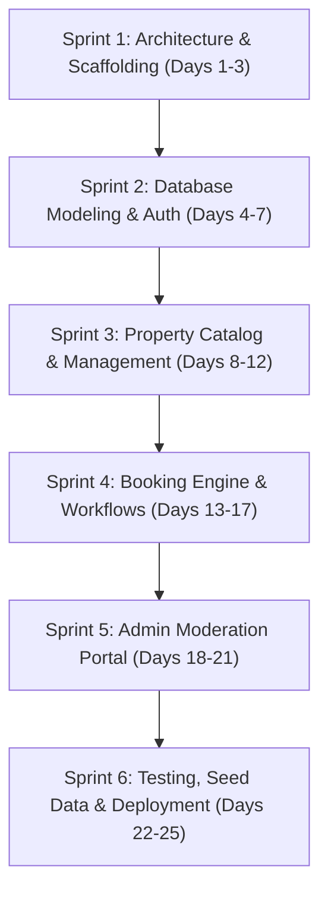

# Project Planning & Sprint Schedule — House Rent Management System

## 1. Project Timeline & Milestone Breakdown

---

## 2. Sprint Backlog & Deliverables

### Sprint 1: Project Setup & Environment Configuration
* Initialize project directory structure (`client` and `server`).
* Setup Git version control, `.gitignore`, and `.env.example`.
* Install core dependencies: Express, Mongoose, React, Axios, React Router, Bootstrap.

### Sprint 2: Authentication & Database Development
* Design Mongoose schemas: `User`, `Property`, `Booking`.
* Implement bcrypt password hashing pre-save hooks and JWT generation.
* Build `/api/auth` endpoints: register, login, me, profile.
* Create JWT authentication and role authorization middleware (`authMiddleware.js`).

### Sprint 3: Property Catalog & Landlord Features
* Build `/api/properties` REST endpoints with multi-filter query logic.
* Implement Owner Dashboard for listing management, editing, deletion, and availability toggling.
* Create responsive React pages: `Home.jsx`, `PropertyListings.jsx`, `PropertyDetails.jsx`, `AddEditProperty.jsx`.

### Sprint 4: Rental Booking Engine
* Build `/api/bookings` endpoints for lease requests, tenant history, and landlord responses.
* Enforce business rules: prevent owners from booking own houses, validate move-in dates.
* Implement `TenantDashboard.jsx` (My Bookings) with real-time status pills.

### Sprint 5: Admin Moderation Portal
* Build `/api/admin` metrics aggregation and moderation endpoints.
* Implement 1-click property approval/rejection with administrator feedback.
* Build user management directory and platform-wide booking audit tables.

### Sprint 6: Testing, Seed Data & College Documentation
* Implement realistic sample seed database (8 properties, 5 users, 3 bookings).
* Setup in-memory MongoDB fallback for instant evaluation.
* Run automated 14-step end-to-end integration test suite.
