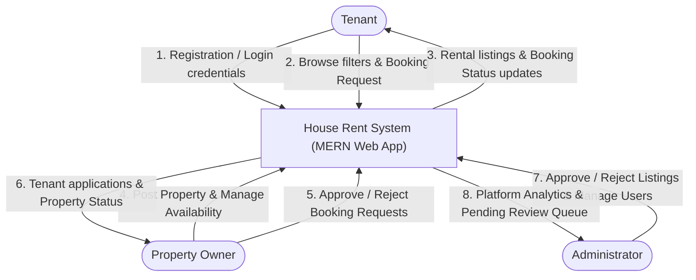
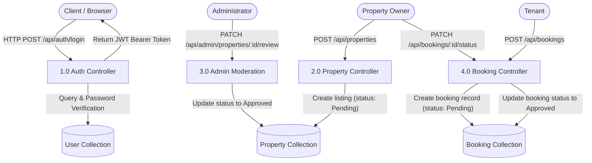

# Data Flow Diagrams (DFD) & Agile User Stories — House Rent

## 1. Agile User Stories

### User Story 1: Property Discovery
> **As a** prospective tenant,  
> **I want to** search for rental properties by city and price range,  
> **So that** I can find houses that meet my budget without visiting brokers in person.

### User Story 2: Listing Residential Space
> **As a** property landlord,  
> **I want to** post my flat with amenities, photos, and rent,  
> **So that** genuine tenants can discover my property directly.

### User Story 3: Admin Moderation
> **As an** administrator,  
> **I want to** audit newly submitted properties in a moderation queue,  
> **So that** only legitimate, verified listings appear publicly on the platform.

### User Story 4: Rental Application & Approval
> **As a** tenant,  
> **I want to** submit a lease booking with my desired move-in date,  
> **So that** the landlord can review my application and approve my stay.

---

## 2. Data Flow Diagram (DFD) Level 0 (Context Level)

---

## 3. Data Flow Diagram (DFD) Level 1

